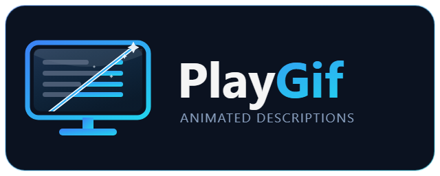

# PlayGif Playnite Extension

   

  

  

  

A Playnite extension that brings game descriptions to life. Instead of the static text panel, descriptions render through a real browser engine — so Steam store trailers, GIFs, animated WebP and AVIF all play inline, exactly as they look on the store page.

Designed for Desktop mode, with experimental Fullscreen support.

Built with the help of Claude Code

---

## What's New - v1.0.0

### Added
- **Animated descriptions.** Steam store trailers, GIFs, animated WebP and AVIF play inline instead of appearing as static text.
- **Fetch rich descriptions** from Steam or GOG for a single game, or in bulk across your whole library.
- **Add your own media** to any description — from a local file, a URL, or a built-in web image search.
- **Per-game video scale** (25/50/75%), plus a global scale and max-height limit.

### Performance
- **Videos play as H.264 MP4 wherever available.** Steam serves both VP9 WebM and H.264 MP4; PlayGif now always picks the MP4, which is hardware-decoded far more widely — noticeably smoother playback and roughly half the disk use.
- **Offline media caching** with a configurable per-game size limit.
- Playback pauses automatically while a game is running or when Playnite loses focus.

---

## Features

- **Animated inline content** — video, GIF, animated WebP and AVIF, rendered by the WebView2 engine
- **Store descriptions** — pulls rich media descriptions from Steam and GOG when local metadata is plain text
- **Custom media** — add your own clips or images to the top or bottom of any description
- **Video sizing** — global scale and height cap, with per-game overrides
- **Offline cache** — media is cached locally with a per-game size limit
- **Resource-aware** — pauses playback when a game launches or Playnite loses focus
- **Theme compatible** — injects into the existing description panel, so themes keep their layout

---

## Requirements

- **Playnite 10** (SDK 6.16.0)
- **Windows 10 (2004 / May 2020 update) or newer**, or Windows 11
- **WebView2 Evergreen Runtime** — pre-installed on Windows 11 and most Windows 10 machines. If missing, get it from [Microsoft](https://developer.microsoft.com/en-us/microsoft-edge/webview2/)
- **FFmpeg** *(optional)* — only used to convert the rare video that a store publishes exclusively as WebM. Without it, those clips still play.

---

## Installation

1. Download the latest `.pext` from [Releases](https://github.com/aHuddini/PlayGif/releases)
2. Open Playnite → Add-ons → Extensions
3. Click **Add extension** and select the `.pext`
4. Restart Playnite

---

## Usage

Right-click any game for the **PlayGif** menu:

| Action | What it does |
|---|---|
| **Add media** | Insert a local file, a URL, or a web image search result at the top or bottom of the description |
| **Remove media** | Pick a media file to remove; it is stripped from the description too |
| **Refresh description** | Clears the cache and re-fetches, for when a description looks wrong |
| **Video scale** | Set 25/50/75% for this game, or reset to the global default |
| **Fetch description** | Pull a rich description from Steam or GOG |

Library-wide options live in **Settings → PlayGif**, including the bulk Steam fetch.

---

## Licensing and Dependencies

PlayGif is MIT licensed. All third-party dependencies use permissive licenses (MIT or BSD 3-Clause). See [THIRD-PARTY-NOTICES](THIRD-PARTY-NOTICES) for details.

### Codec and Media Licensing

**PlayGif ships no media codecs.** All decoding (H.264, VP8/VP9, AVIF, animated WebP, GIF) is handled by the WebView2 Evergreen Runtime — a system component installed and maintained by Microsoft. PlayGif bundles only the managed WebView2 API wrapper and native loader: no Chromium binaries, no codec libraries, no patent-encumbered components. Codec licensing (MPEG LA for H.264, etc.) is the runtime distributor's responsibility, not this extension's.

### Store APIs

PlayGif fetches descriptions from Steam's public store API (`store.steampowered.com/api/appdetails`) and GOG's product API — the same endpoints used by Playnite's own metadata plugins. No API key is required, and requests are rate-limited with retry logic.

---

## Support

- **Issues**: https://github.com/aHuddini/PlayGif/issues
